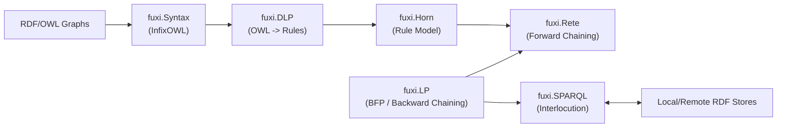
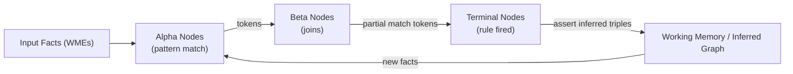

FuXi is a highly efficient, Python-based, semantic web logical reasoning system. It is
being re-written for modern Python 3.9+ and adapted for use with transformer-based AI systems and their frameworks.

## Changelog

See [CHANGELOG.md](https://github.com/chimezie/FuXi-reincarnate/blob/main/CHANGELOG.md)
for the full release history. The latest release notes are at
[Releases](https://github.com/chimezie/FuXi-reincarnate/releases).

Robert Doorenbos (1995) wrote about:

> Production Matching for Large Learning Systems.

His thesis includes algorithms, most of which are implemented, describing a modification of the original Rete algorithm, 
limiting its fact syntax to 3-item tuples which corresponds quite nicely with the RDF abstract syntax. 
It also describes methods for using hash tables to improve the efficiency of alpha nodes and beta nodes.

Instances of the fuxi.Rete.ReteNetwork class are RETE-UL networks.  These are used with a complement of
various rule and query evaluation and re-writing strategies to facilitate efficient, goal-directed reasoning and querying
over RDF datasets.

Fuxi has a SPARQL SERVICE mediation API: a `SPARQLServiceGraph` class in the **fuxi.SPARQL.service** module
with support for evaluating SPARQL "SERVICE" queries against scalable, efficient, remote SPARQL services such as:
- [Virtuoso](https://virtuoso.openlinksw.com/)
- [Qlever](https://github.com/ad-freiburg/qlever)
- etc.

## Architecture Overview

Major components and how they interact (with emphasis on InfixOWL and SPARQL interlocution):



## RETE Network Flows

Alpha/Beta network, working memory, and token propagation:



SIP adornment and magic set rewriting flow:


## Development Setup

Install uv if not already installed (via package manager preferred)

Create a virtual environment and install dependencies:

```bash
uv venv
source .venv/bin/activate
uv pip install -e .
```

Run tests with uv:

```bash
uv run pytest test
```

## InfixOWL

InfixOWL provides a Pythonic DSL for building OWL class expressions and
ontologies using RDFLib graphs. It is useful for programmatically constructing
OWL classes, properties, and restrictions, then serializing them to RDF.

Basic example:

```python
from rdflib import Graph, Namespace
from fuxi.Syntax.InfixOWL import Class, Property, Restriction

ex = Namespace("http://example.org/")
g = Graph()

Person = Class(ex.Person, graph=g)
Parent = Class(ex.Parent, graph=g)
hasChild = Property(ex.hasChild, graph=g)

Parent.equivalent_class = [
    Person & Restriction(hasChild, some_values_from=Person)
]

print(g.serialize(format="turtle"))
```

More examples:

```python
from rdflib import Literal, XSD

# Boolean class expressions
Person & Student
Person | Student
~Person

# Infix restriction operators
has_part | some | Organ
has_part | only | Organ
has_part | value | ex.Heart
has_part | min | Literal(1)
has_part | max | Literal(3)
has_part | exactly | Literal(2)

# Method helpers (equivalent to infix operators)
has_part.some(Organ)
has_part.only(Organ)
has_part.value(ex.Heart)
has_part.min(Literal(1))
has_part.max(Literal(3))
has_part.exactly(Literal(2))

# Cardinality comparisons without operator overrides
has_part.cardinality >= 1
has_part.cardinality <= 3
has_part.cardinality == 2

# Qualified cardinality comparisons
has_part.cardinality(Organ) >= 2
has_part.cardinality(Organ) <= 3
has_part.cardinality(Organ) == 1

# Qualified cardinality for data property ranges
age.cardinality(XSD.integer) >= 1
age.cardinality(XSD.integer) <= 3
age.cardinality(XSD.integer) == 1

# Qualified cardinality helpers
has_part.min_cardinality(2, Organ)
has_part.max_cardinality(3, Organ)
age.min_cardinality(1, XSD.integer)
age.max_cardinality(3, XSD.integer)

# Combine expressions
Organ & has_part.some(Organ) & (has_part.cardinality >= 1)
```

Convenience helpers:

```python
from rdflib import Graph, Namespace
from fuxi.Syntax.InfixOWL import Class, GraphContext

ex = Namespace("http://example.org/")
g = Graph()

with GraphContext(g, {"ex": ex}):
    has_child = ex.prop("hasChild")
    person = Class(ex.Person)
    parent = Class(ex.Parent)
    parent.equivalent_class = [person & has_child.some(person)]
```

### InfixOWL API conventions (Python 3+)

InfixOWL has been modernized to follow Python 3 naming conventions and idioms.
The API now uses snake_case exclusively for public properties and methods.

Impact on the API:
- CamelCase accessors have been removed. For example: `subClassOf` -> `sub_class_of`,
  `equivalentClass` -> `equivalent_class`, `onProperty` -> `on_property`.
- Restriction keyword arguments are snake_case only (e.g., `some_values_from`,
  `all_values_from`, `has_value`, `min_cardinality`).
- Migration note: camelCase accessors (e.g., `seeAlso`, `subClassOf`) were removed; use
  snake_case equivalents.
- `label` accepts `str` or `Literal`; strings are coerced to `Literal`.

Syntactic sugar improvements:
- `GraphContext` sets `Individual.factoryGraph` and optional namespace bindings.
- `Namespace.prop(name)` creates a `Property` under the namespace.
- `Property` helpers build restrictions directly: `some`, `only`, `value`,
  `min`, `max`, `exactly`.
- `Property.cardinality` enables Pythonic comparisons:
  `prop.cardinality >= 1`, `prop.cardinality <= 2`, `prop.cardinality == 1`.
- Qualified cardinality uses `prop.cardinality(Class) >= 1` (OWL 2
  `minQualifiedCardinality`).
- owlapy adapters are available for interop.

### OWL engineering and management

FuXi's __**InfixOWL**__ can be used with Python design patterns to compose and annotate OWL ontologies, using
OWL_DSL annotations, covered later, for example, to render their logical definitions in a human-readable
format.

```python
from rdflib import Graph, Literal, Namespace
from fuxi.Syntax.InfixOWL import GraphContext, Class, Property, AnnotationProperty

HEALTH = Namespace("[..]]")
PTREC = Namespace("[..]")
DNODE = Namespace("[..]")
OWL_DSL = Namespace("https://github.com/chimezie/OWL_DSL/tree/main/ontology_configurations/")
OBO_NS = Namespace("http://purl.obolibrary.org/obo/")

singular_phrase = OWL_DSL.OWL_DSL_000001
plural_phrase = OWL_DSL.OWL_DSL_000002

g = Graph()

with GraphContext(g, {"health": HEALTH, "ptrec": PTREC}):
        has_part = Property(OBO_NS.BFO_0000051, label="has part")
        ice = Class(OBO.IAO_0000030, label="information content entity")
        contains = Property(DNODE.contains, label="contains", domain=[ice], range=[ice],
                            subproperty_of=[has_part]) #has part
        contains.declare_annotation_property(singular_phrase)
        contains.declare_annotation_property(plural_phrase)
        definition = contains.declare_annotation_property(OWL_DSL.IAO_0000115)
        
        contains.set_annotation(singular_phrase, "contains {} (part of a patient record)")
        contains.set_annotation(plural_phrase, "contains {} (parts of a patient record)")

        contains.set_annotation(definition, 
                                "A relation that stands between elements of an electronic record system")
        definition.set_annotation(definition, 
                                  "The official definition, explaining the meaning of a class or property")
        has_part.set_annotation(definition,
                                "a core relation that holds between a whole and its part")
        
        history_and_physical_event = Class(PTREC.Event_evaluation_history_and_physical, label="History and physical event")
        history_and_physical_event.sub_class_of [Class(PTREC.Event, label="Medical Record Event")]         
        
        h_and_p_with_htn_dx = Class(HEALTH.H_and_P_with_htn_dx, label="Historical Htx Dx from H/P event")
        h_and_p_with_htn_dx.set_annotation(OWL_DSL.IAO_0000115, 
                                           "An H/P event (within a patient record) that has a Dx of hypertension as a part")
        
        h_and_p_with_htn_dx.equivalent_class = [history_and_physical_event & contains.some(
          Class(PTREC.dx_pulmonary_hypertension_primary, label="Pulmonary hypertension primary DX") | 
          Class(PTREC.dx_vascular_systemic_hypertension, label="Vascular hypertension primary DX"))]
```

And this is how the equivalent can be done with owlready2, a more declarative approach:

```python
from owlready2 import Thing, ObjectProperty, AnnotationProperty, World

world = World()
onto = world.get_ontology("[..]")
owl_dsl_ns = onto.get_namespace(OWL_DSL)
PTREC_NS = ontology.get_namespace([..])
DNODE_NS = ontology.get_namespace([..])
OBO_NS = ontology.get_namespace("http://purl.obolibrary.org/obo/")
with onto:
    with owl_dsl_ns: #OWL_DSL OWL CNL template annotation vocabulary
        class OWL_DSL_000001(AnnotationProperty): pass
    
    with OBO_NS: #IAO and BFO/RO namespace use
        class IAO_0000115(AnnotationProperty): 
          label = ["definition"]
        class IAO_0000030(Thing): 
          label = ["information content entity"]
        class BFO_0000051(ObjectProperty):
          label = ["has part"]           
          OWL_DSL_000001 = ["has {} as a part"]
            
    with DNODE_NS:
      class contains(BFO_0000051):
        domain = [IAO_0000030]
        range = [IAO_0000030]
        label = ["contains"]      
        OWL_DSL_000001 = ["contains {} (part of a patient record)"]
        IAO_0000115 = ["A relation that stands between elements of an electronic record system"]
            
    with PTREC_NS:
      class Event_evaluation_history_and_physical(Thing):
          label = ["History and physical event"]
      class MedicalDiagnosis_vascular_systemic_hypertension(Thing):
        label = ["Vascular systemic hypertension"]
      class MedicalDiagnosis_pulmonary_hypertension_primary(Thing):
        label = ["Pulmonary hypertension primary DX"]
            
    class H_and_P_with_htn_dx(Event_evaluation_history_and_physical):
        label = ["Htx Dx from H/P event"]
        equivalent_to = [Event_evaluation_history_and_physical & 
                         contains.some(MedicalDiagnosis_vascular_systemic_hypertension |
                                       MedicalDiagnosis_pulmonary_hypertension_primary)]
```

Notes:
- `OWL_DSL_000001/000002/000003` are annotation properties used by OWL_DSL to
  render role restriction phrasing (singular, plural, question forms).
- InfixOWL graphs serialize to RDF and can be loaded into owlready2 worlds for
  rendering or reasoning, matching the patterns used in OWL_DSL's test suite.

### Syntax comparison

The table below maps common OWL 2 Functional Syntax elements to their
corresponding InfixOWL and owlapy usage.

| OWL 2 Functional Syntax | Manchester OWL | InfixOWL (Python DSL) | owlapy (OWLAPI) | owlready2 |
| --- | --- | --- | --- | --- |
| `Class(:Person)` | `Class: Person` | `Person = Class(ex.Person, graph=g)` | `person = OWLClass("http://example.org/Person")` | `with onto: class Person(Thing): pass` |
| `ObjectIntersectionOf(:A :B)` | `A and B` | `A & B` | `OWLObjectIntersectionOf([a, b])` | `A & B` |
| `ObjectUnionOf(:A :B)` | `A or B` | `A \| B` | `OWLObjectUnionOf([a, b])` | `A \| B` |
| `ObjectComplementOf(:A)` | `not A` | `~A` | `OWLObjectComplementOf(a)` | `~A` |
| `ObjectSomeValuesFrom(:p :C)` | `p some C` | `Restriction(p, some_values_from=C)` or `p.some(C)` | `OWLObjectSomeValuesFrom(p, c)` | `p.some(C)` |
| `ObjectAllValuesFrom(:p :C)` | `p only C` | `Restriction(p, all_values_from=C)` or `p.only(C)` | `OWLObjectAllValuesFrom(p, c)` | `p.only(C)` |
| `ObjectHasValue(:p :i)` | `p value i` | `Restriction(p, has_value=i)` or `p.value(i)` | `OWLObjectHasValue(p, i)` | `p.value(i)` |
| `ObjectMinCardinality(1 :p :C)` | `p min 1 C` | `Restriction(p, min_cardinality=Literal(1))`, `p.min(Literal(1))`, or `p.cardinality >= 1` | `OWLObjectMinCardinality(p, 1, c)` | `p.min(1, C)` |
| `ObjectMaxCardinality(1 :p :C)` | `p max 1 C` | `Restriction(p, max_cardinality=Literal(1))`, `p.max(Literal(1))`, or `p.cardinality <= 1` | `OWLObjectMaxCardinality(p, 1, c)` | `p.max(1, C)` |
| `ObjectMinQualifiedCardinality(1 :p :C)` | `p min 1 C` | `p.cardinality(C) >= 1` or `p.min_cardinality(1, C)` | `OWLObjectMinCardinality(p, 1, c)` | `p.min(1, C)` |
| `ObjectMaxQualifiedCardinality(1 :p :C)` | `p max 1 C` | `p.cardinality(C) <= 1` or `p.max_cardinality(1, C)` | `OWLObjectMaxCardinality(p, 1, c)` | `p.max(1, C)` |
| `ObjectExactQualifiedCardinality(1 :p :C)` | `p exactly 1 C` | `p.cardinality(C) == 1` or `p.qualified_cardinality(1, C)` | `OWLObjectExactCardinality(p, 1, c)` | `p.exactly(1, C)` |
| `ObjectExactCardinality(1 :p :C)` | `p exactly 1 C` | `Restriction(p, cardinality=Literal(1))` or `p.exactly(Literal(1))` | `OWLObjectExactCardinality(p, 1, c)` | `p.exactly(1, C)` |
| `ObjectOneOf(:a :b)` | `{ a , b }` | `EnumeratedClass(members=[ex.a, ex.b])` | `OWLObjectOneOf([a, b])` | `OneOf([a, b])` |
| `SubClassOf(:A :B)` | `Class: A SubClassOf: B` | `A.sub_class_of = [B]` or `A += B` | `OWLAxiom` with `OWLSubClassOfAxiom(a, b)` | `A.is_a.append(B)` |
| `EquivalentClasses(:A :B)` | `Class: A EquivalentTo: B` | `A.equivalent_class = [B]` | `OWLAxiom` with `OWLEquivalentClassesAxiom([a, b])` | `A.equivalent_to.append(B)` |
| `DataSomeValuesFrom(:age xsd:integer)` | `age some xsd:integer` | `Restriction(age, some_values_from=XSD.integer)` | `OWLDataSomeValuesFrom(age, XSD.integer)` | `age.some(int)` |
| `DataAllValuesFrom(:age xsd:integer)` | `age only xsd:integer` | `Restriction(age, all_values_from=XSD.integer)` | `OWLDataAllValuesFrom(age, XSD.integer)` | `age.only(int)` |
| `DataHasValue(:age "42"^^xsd:integer)` | `age value 42` | `Restriction(age, has_value=Literal(42))` | `OWLDataHasValue(age, Literal(42))` | `age.value(42)` |
| `DataMinCardinality(1 :age xsd:integer)` | `age min 1 xsd:integer` | `Restriction(age, min_cardinality=Literal(1))` | `OWLDataMinCardinality(age, 1, XSD.integer)` | `age.min(1, int)` |
| `DataMaxCardinality(1 :age xsd:integer)` | `age max 1 xsd:integer` | `Restriction(age, max_cardinality=Literal(1))` | `OWLDataMaxCardinality(age, 1, XSD.integer)` | `age.max(1, int)` |
| `DataExactCardinality(1 :age xsd:integer)` | `age exactly 1 xsd:integer` | `Restriction(age, cardinality=Literal(1))` | `OWLDataExactCardinality(age, 1, XSD.integer)` | `age.exactly(1, int)` |
| `DataMinQualifiedCardinality(1 :age xsd:integer)` | `age min 1 xsd:integer` | `age.cardinality(XSD.integer) >= 1` or `age.min_cardinality(1, XSD.integer)` | `OWLDataMinCardinality(age, 1, XSD.integer)` | `age.min(1, int)` |
| `DataMaxQualifiedCardinality(1 :age xsd:integer)` | `age max 1 xsd:integer` | `age.cardinality(XSD.integer) <= 1` or `age.max_cardinality(1, XSD.integer)` | `OWLDataMaxCardinality(age, 1, XSD.integer)` | `age.max(1, int)` |
| `DataExactQualifiedCardinality(1 :age xsd:integer)` | `age exactly 1 xsd:integer` | `age.cardinality(XSD.integer) == 1` or `age.qualified_cardinality(1, XSD.integer)` | `OWLDataExactCardinality(age, 1, XSD.integer)` | `age.exactly(1, int)` |

### InfixOWL and other OWL Python libraries / APIs

OWL_DSL can render a Controlled Natural Language (CNL) sentence for an OWL class using Owlready2's API.
Labels and annotation for classes and properties in an OWL ontology can be set directly via the 
InfixOWL API to facilitate using OWL_DSL to fully render the logical semantics of their formal definitions.

## Command Line Usage

FuXi provides focused sub-commands:

- `fuxi.core`: forward chaining, RDF serialization, RETE diagnostics
- `fuxi.proof`: BFP query answering, proof graph and SIP graph output
- `fuxi.owl`: OWL/DLP workflows, ontology-driven reasoning, Manchester OWL output

The legacy `fuxi` command remains as a compatibility wrapper and routes to the
appropriate sub-command.

Core invocation patterns:

```bash
uv run --active --extra dev fuxi.core [options] factFile1 factFile2 ...
uv run --active --extra dev fuxi.proof [options] factFile1 factFile2 ...
uv run --active --extra dev fuxi.owl [options] factFile1 factFile2 ...
```

Common options:

- `--rules PATH_OR_URI` (repeatable): Notation3 rulesets
- `--input-format {xml,trix,n3,nt,rdfa}`: input RDF format
- `--output FORMAT`: output mode (see table below)
- `--ns PREFIX=URI` (repeatable): namespace bindings
- `--why "SPARQL query"`: goal-directed query (use with `fuxi.proof` or `fuxi.owl`)
- `--method {naive,bfp}`: available on `fuxi.owl` and compatibility wrapper
- `--first-answer`: stop after first BFP answer

### Output Formats

| Output | Description | Notes |
| --- | --- | --- |
| `n3`, `nt`, `xml`, `TriX` | RDF serialization of inferred (or closure) triples | default is `n3` |
| `conflict` | textual RETE conflict-set summary | prints to stdout |
| `rif`, `rif-xml` | rule serialization | primarily for rule inspection |
| `man-owl` | Manchester OWL rendering of OWL/RDF | use `--class` / `--property` selectors |
| `proof-graph-svg`, `proof-graph-png` | proof graph rendering | requires `--why --method=bfp` |
| `rete-network-svg`, `rete-network-png` | RETE network visualization | works in naive or BFP runs |
| `sip-collection-svg`, `sip-collection-png` | SIP collection visualization | requires `--why --method=bfp` |

### Graph Output Behavior

Graph outputs (`proof-graph-*`, `rete-network-*`, `sip-collection-*`) are
binary/markup payloads written directly to stdout. Pipe them to files:

```bash
uv run --active --extra dev fuxi.proof \
  --rules test/command_line_test_rules.n3 \
  --input-format n3 \
  --ns fam=http://dev.w3.org/2000/10/swap/test/cwm/fam.n3# \
  --why "PREFIX fam: <http://dev.w3.org/2000/10/swap/test/cwm/fam.n3#> SELECT ?a { fam:david fam:ancestor ?a }" \
  --output proof-graph-svg \
  test/command_line_facts.n3 > proof.svg
```

```bash
uv run --active --extra dev fuxi.core \
  --rules test/command_line_test_rules.n3 \
  --input-format n3 \
  --ns fam=http://dev.w3.org/2000/10/swap/test/cwm/fam.n3# \
  --output rete-network-png \
  test/command_line_facts.n3 > rete.png
```

> Note: Graph rendering requires Graphviz (`dot`) available in your environment.

### Practical Recipes

Naive forward chaining to inferred triples:

```bash
uv run --active --extra dev fuxi.core \
  --rules test/command_line_test_rules.n3 \
  --input-format n3 \
  --ns fam=http://dev.w3.org/2000/10/swap/test/cwm/fam.n3# \
  --output n3 \
  test/command_line_facts.n3
```

BFP query answering (variable bindings):

```bash
uv run --active --extra dev fuxi.proof \
  --rules test/command_line_test_rules.n3 \
  --input-format n3 \
  --ns fam=http://dev.w3.org/2000/10/swap/test/cwm/fam.n3# \
  --why "PREFIX fam: <http://dev.w3.org/2000/10/swap/test/cwm/fam.n3#> SELECT ?a { fam:david fam:ancestor ?a }" \
  test/command_line_facts.n3
```

## SPARQL 1.1 entailment regimes and a Data Description Language (DDL)

FuXi uses DDL to declare which predicates are derived (IDB) vs base (EDB), which
in turn controls top-down query mediation and Magic Set rewriting.

See `DataDescriptionLanguage.md` for the full vocabulary and examples.

Short usage snippet (top-down mediation):

`owl_entailment_regime_graph` is a framework for SPARQL 1.1
[entailment regimes](https://www.w3.org/TR/sparql11-entailment/), using the
SPARQL interlocution strategy described in `ARCHITECTURE.md` to mediate query
answers against rules without full materialization and evaluating them against 
independent and even remote RDF Datasets.

```python
from io import StringIO

from rdflib import Graph, Namespace, RDF

from fuxi.Horn.HornRules import horn_from_n3
from fuxi.SPARQL.utilities import owl_entailment_regime_graph

ex = Namespace("http://example.org/")
fact_graph = Graph().parse("path/to/facts.ttl", format="turtle")
ns_map = {"ex": ex}
rules_n3 = """
@prefix ex: <http://example.org/> .
{ ?s ex:parentOf ?o } => { ?s ex:relatedTo ?o } .
"""
extra_rulesets = [horn_from_n3(StringIO(rules_n3))]
goals = [
  (ex.alice, RDF.type, ex.Person),
  (ex.alice, ex.parentOf, ex.bob),
]

entail_graph, _closure_delta = owl_entailment_regime_graph(
  fact_graph,
  ns_map,
  extra_rulesets=extra_rulesets,
  goals=goals,
)

result = entail_graph.query(
  "SELECT ?s ?o WHERE { ?s ex:relatedTo ?o }"
)
```

When goals include `RDF.type`, the object (e.g., `ex.Person`) is treated as the
derived predicate for goal-directed resolution.

If `fact_graph` has OWL 2 axioms that are axiomatizeable by a ruleset,
then the semantics of the ruleset will be used for OWL entailment of axioms as well.

CLI example (BFP + SPARQL endpoint):

```console
$ fuxi.proof \
  --why="SELECT ?label { ?drug a drugbank:InfluenzaDrug; rdfs:label ?label }" \
  --hybrid \
  --idb=drugbank:InfluenzaDrug \
  --ns=drugbank=http://www4.wiwiss.fu-berlin.de/drugbank/resource/drugbank/ \
  --ns=rdfs=http://www.w3.org/2000/01/rdf-schema# \
  --ontology=test/SPARQL/drugBankOnt.n3 \
  --ontology-format=n3 \
  --sparql-endpoint \
  --dlp \
  http://www4.wiwiss.fu-berlin.de/drugbank/sparql
```

## SPARQL Graph Wrapper

Fuxi includes a query-only graph wrapper for a remote SPARQL service (**fuxi.SPARQL.service**).  It  mediates SPARQL 
query evaluation by extracting the basic graph pattern (BGP) from a query, compiling it into an ``EDBQuery``, and 
issuing a service query against the configured SPARQL endpoint. It is designed to plug into FuXi's 
SPARQL entailment machinery so you can implement SPARQL 1.1 entailment regimes over remote services independent of 
any reasoning capabilities of the service.

### Querying TopDownSPARQLEntailingStore

The ``sparql_interlocution`` function provides a convenient way to execute SPARQL queries 
against a ``TopDownSPARQLEntailingStore`` and yield solutions:

```python
from rdflib import Variable
from fuxi.SPARQL.utilities import sparql_interlocution

for answer in sparql_interlocution(query, top_down_store):
  movie = answer[Variable('movie')]
  print(f"Movie: {movie}")
```

This function bridges SPARQL query text and FuXi's backwards-chaining evaluation engine. 
It parses the query, extracts the basic graph pattern, converts triples to quads, and uses 
the store's ``batch_unify`` to retrieve matching solutions. Only solutions where all query 
variables are bound are yielded.

## Testing

Run the full pytest suite:

```bash
uv run pytest test
```

Fuxi comes with harnesses to run the various OWL tests suites:

- `pytest test/testOWL.py` - ["OWL 1"](http://www.w3.org/2002/03owlt/approved.zip) - harness for the original OWL test cases
- `pytest test/testOWL2.py` - ["OWL 2"](http://www.w3.org/2009/01/pr-owl2-test-cases-20100301/) - similar harness for OWL 2 test cases (conformance conditions)

FuXi also includes a SPARQL entailment harness for selected W3C SPARQL 1.1
entailment tests:

- `pytest test/SPARQL/test_sparql_entailment.py` - manifest-driven SPARQL
  entailment regression harness over `ent:RDFS` and `ent:RDF` regimes

Run the OWL test suite (each APPROVED test is an individual pytest case):

```bash
uv run pytest test/testOWL.py
```

### OWL Test Options

The OWL test harness supports several custom pytest options:

| Option | Description |
|--------|-------------|
| `--strategy` | Reasoning strategy: `bfp` (default) or `naive` |
| `--ground-query` | For top-down strategies, solve ground triple patterns |
| `--single-test` | Run only the test matching the given identifier (format varies by test file) |
| `--owl-debug` | Enable verbose OWL entailment debugging |
| `--capture-proofs` | Capture PML proof graphs for tests |
| `--profile` | Enable pytest profiling |

The same options are shared by the SPARQL entailment harness when relevant
(`--single-test` and `--owl-debug` are especially useful for focused triage).

### Running Specific OWL Tests

```bash
# OWL 1 — filter by premise file path
uv run pytest test/testOWL.py --single-test OWL/TransitiveProperty/premises001 --ground-query

# OWL 2 — filter by test identifier (base ID, no goal suffix)
uv run pytest test/testOWL2.py --single-test WebOnt-equivalentProperty-001

# OWL 2 — run with verbose debugging
uv run pytest test/testOWL2.py --single-test WebOnt-equivalentProperty-001 --owl-debug

# OWL 2 — capture proof diagrams for a specific test
uv run pytest test/testOWL2.py --single-test WebOnt-equivalentProperty-001 --capture-proofs

# Run with BFP strategy (backward-chaining)
uv run pytest test/testOWL.py --strategy bfp

# Run with naive forward-chaining strategy
uv run pytest test/testOWL.py --strategy naive

# Filter OWL 1 tests using pytest -k (by test ID)
uv run pytest test/testOWL.py -k "TransitiveProperty"

# Run all OWL 1 tests in a specific category
uv run pytest test/testOWL.py -k "OWL/differentFrom"

# Run one SPARQL entailment test by ID
uv run pytest test/SPARQL/test_sparql_entailment.py --single-test rdfs04

# Run a focused SPARQL entailment subset
uv run pytest test/SPARQL/test_sparql_entailment.py -k "paper-sparqldl-Q1-rdfs or sparqldl-05"
```

### SPARQL Entailment Harness Notes

`test/SPARQL/test_sparql_entailment.py` is designed to parallel the OWL harness
style (`test/testOWL.py`, `test/testOWL2.py`):

- It collects one pytest case per approved manifest entry.
- It supports explicit test skips through a `SKIP` map in the harness.
- It compares expected SPARQL XML result sets against FuXi-mediated query
  answers over `TopDownSPARQLEntailingStore`.
- For non-ASK result sets, it verifies expected bindings are a subset of
  actual bindings (extra answers are tolerated).

The harness currently prioritizes `ent:RDFS` (then `ent:RDF`) from the manifest
regime list. Tests that require stronger OWL entailment semantics are tracked in
`SKIP` until a compatible OWL-RDF-Based entailment profile is enabled for this
path.

**`--single-test` identifier format:**

- `testOWL.py` — the premise file path, e.g. `OWL/TransitiveProperty/premises001`
- `testOWL2.py` — the base test identifier from the manifest, e.g. `WebOnt-equivalentProperty-001`.
  Each test can produce multiple goal-instances (e.g. `_0`, `_1`) which share the same base ID;
  the filter matches all of them at once.

### Filtering OWL Tests with `-k`

The test ID format is: `MANIFEST_PATH::normalized_manifest::test_uri::premise_file`

- Use the normalized manifest path (slashes replaced with `_`), for example `OWL_I5.1_Manifest001.rdf`
- The manifest test IDs are always `test`, so the test ID form is `I5.1/Manifest001#test`

## Details ##

See [this wiki](https://github.com/chimezie/FuXi-reincarnate/blob/fuxi-reincarnate/ARCHITECTURE.md) for more architectural details. 

### fuxi.DLP ###

The **fuxi.DLP** module is a definition of Description Horn Logic as described by Grosof, B. et.al. 
("Description Logic Programs: Combining Logic Programs with Description Logic"  @p117-grosof.pdf) in section 4.4. 
It implements recursive mapping functions "T", "Th" and "Tb" which result in "custom" (dynamic) rulesets.

This essentially allows OWL ontologies (or a subset of OWL ontologies) to be automatically converted to a set of rules 
that exactly capture the semantics of the OWL document.

The `setupDescriptionLogicProgramming` method can be invoked on a ReteNetwork instance, passing in an RDFLib Graph that 
consists of the OWL assertions that we wish to translate to a ruleset as the only argument. This method will return a 
list of RuleSet objects each of which represents a rule that was translated from the OWL assertions.

This method also takes a safety keyword that is any of the safety flags described above.

The TBox OWL RDF graph is normalized before using the setupDescriptionLogicProgramming method. This is necessary 
in order to handle certain OWL nested axioms.

After execution, the network.inferredFacts graph will now have all the RDF statements that can be inferred from the \
combination of the OWL graph and the instance graph. The DLP algorithm only supports a subset of OWL-DL, so not all 
OWL graphs will be properly axiomatized.

Finally, a network can be reset via the network.reset() method. This will clear the RETE-UL network, and is useful when 
you want to setup a network once from an OWL graph and calculate the closure delta graph for multiple instance graphs 
from the same ruleset. After resetting the network, the TBox graph will both need to be sent through the network again, 
followed by the later instance graph.

```python
from fuxi.Horn.HornRules import horn_from_dl
from rdflib.Graph import Graph
from rdflib.util import first

first([r for r in horn_from_dl(Graph().parse('http://www.lehigh.edu/%7Ezhp2/2004/0401/univ-bench.owl')) if
       not r.is_safe()]) 
```

```console
Forall ?X ( Exists _:[.bnode label.] ( Course([.bnode label.]) ) :- TeachingAssistant(?X) )
```

Here, the first unsafe rule from the Lehigh University Benchmark ontology is printed out. The rule is unsafe because 
the existential variable in the rule head does not appear in the body.

We can look at the OWL formulae via OWL 2 Manchester OWL format for the TeachingAssistant class to see 
why its conversion to rules includes 
an unsafe rule:

```console
$ fuxi.owl --class=:TeachingAssistant --output=man-owl http://www.lehigh.edu/%7Ezhp2/2004/0401/univ-bench.owl
Class: :TeachingAssistant 
    ## A Defined Class (university teaching assistant) ##
    EquivalentTo: person THAT ( 'is a teaching assistant for' SOME teaching course )
```

### fuxi.LP ### 
FuXi includes a backwards fixpoint procedure (BFP) implementation in Python, a sound and complete query answering 
method for recursive databases based on meta-interpretation. It uses RETE-UL as the RIF PRD implementation of a 
meta-interpreter of an adorned ruleset that builds large, conjunctive (BGPs) SPARQL queries.

Specialized BFP meta-interpretation rules are used to build a RETE-UL decision network that is modified to support the 
propagation of bindings from the evaluate predicates into a supplimental magic set sip strategy and the generation of 
subqueries. The end result is a bottom-up simulation of SLD resolution.

Specialization is applied to the BFP meta-interpreter with respect to the rules of the object program. For each rule of 
the meta-interpreter that includes a premise referring to a rule of the object program, one specialized version is 
created for each rule of the object program.  OpenQuery is used with predicate symbols to indicate a query without any 
bindings provided to the program (disadvantageous for GMS).

The Beta Nodes are changed in the following way:

Take a BetaNode (and a BFP rule) that joins values from an evaluate condition with other conditions and replace 
the alpha node (and memory) used to represent the condition with a pass-thru beta with no parent nodes but whose 
right memory will be used to add bindings instantiated from evaluate assertions in the BFP algorithm.
