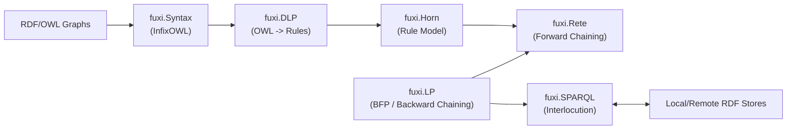
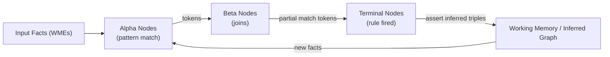

FuXi is a highly efficient, Python-based, semantic web logical reasoning system. It is
being re-written for modern Python 3.9+ and adapted for use with transformer-based AI systems and their frameworks.

Robert Doorenbos (1995) wrote about:

> Production Matching for Large Learning Systems.

His thesis includes algorithms, most of which are implemented, describing a modification of the original Rete algorithm, 
limiting its fact syntax to 3-item tuples which corresponds quite nicely with the RDF abstract syntax. 
It also describes methods for using hash tables to improve the efficiency of alpha nodes and beta nodes.

Instances of the fuxi.Rete.ReteNetwork class are RETE-UL networks.  These are used with a complement of
various rule and query evaluation and re-writing strategies to facilitate efficient, goal-directed reasoning and querying
over RDF datasets.

Fuxi has a SPARQL SERVICE mediation API: a `SPARQLServiceGraph` class in the **fuxi.SPARQL.service** module
with support for evaluating SPARQL "SERVICE" queries against scalable, efficient, remote SPARQL services such as:
- [Virtuoso](https://virtuoso.openlinksw.com/)
- [Qlever](https://github.com/ad-freiburg/qlever)
- etc.

## Architecture Overview

Major components and how they interact (with emphasis on InfixOWL and SPARQL interlocution):



## RETE Network Flows

Alpha/Beta network, working memory, and token propagation:



SIP adornment and magic set rewriting flow:


## Development Setup

Install uv if not already installed (via package manager preferred)

Create a virtual environment and install dependencies:

```bash
uv venv
source .venv/bin/activate
uv pip install -e .
```

Run tests with uv:

```bash
uv run pytest test
```

## InfixOWL

InfixOWL provides a Pythonic DSL for building OWL class expressions and
ontologies using RDFLib graphs. It is useful for programmatically constructing
OWL classes, properties, and restrictions, then serializing them to RDF.

Basic example:

```python
from rdflib import Graph, Namespace
from fuxi.Syntax.InfixOWL import Class, Property, Restriction

ex = Namespace("http://example.org/")
g = Graph()

Person = Class(ex.Person, graph=g)
Parent = Class(ex.Parent, graph=g)
hasChild = Property(ex.hasChild, graph=g)

Parent.equivalent_class = [
    Person & Restriction(hasChild, some_values_from=Person)
]

print(g.serialize(format="turtle"))
```

More examples:

```python
from rdflib import Literal, XSD

# Boolean class expressions
Person & Student
Person | Student
~Person

# Infix restriction operators
has_part | some | Organ
has_part | only | Organ
has_part | value | ex.Heart
has_part | min | Literal(1)
has_part | max | Literal(3)
has_part | exactly | Literal(2)

# Method helpers (equivalent to infix operators)
has_part.some(Organ)
has_part.only(Organ)
has_part.value(ex.Heart)
has_part.min(Literal(1))
has_part.max(Literal(3))
has_part.exactly(Literal(2))

# Cardinality comparisons without operator overrides
has_part.cardinality >= 1
has_part.cardinality <= 3
has_part.cardinality == 2

# Qualified cardinality comparisons
has_part.cardinality(Organ) >= 2
has_part.cardinality(Organ) <= 3
has_part.cardinality(Organ) == 1

# Qualified cardinality for data property ranges
age.cardinality(XSD.integer) >= 1
age.cardinality(XSD.integer) <= 3
age.cardinality(XSD.integer) == 1

# Qualified cardinality helpers
has_part.min_cardinality(2, Organ)
has_part.max_cardinality(3, Organ)
age.min_cardinality(1, XSD.integer)
age.max_cardinality(3, XSD.integer)

# Combine expressions
Organ & has_part.some(Organ) & (has_part.cardinality >= 1)
```

Convenience helpers:

```python
from rdflib import Graph, Namespace
from fuxi.Syntax.InfixOWL import Class, GraphContext

ex = Namespace("http://example.org/")
g = Graph()

with GraphContext(g, {"ex": ex}):
    has_child = ex.prop("hasChild")
    person = Class(ex.Person)
    parent = Class(ex.Parent)
    parent.equivalent_class = [person & has_child.some(person)]
```

### InfixOWL API conventions (Python 3+)

InfixOWL has been modernized to follow Python 3 naming conventions and idioms.
The API now uses snake_case exclusively for public properties and methods.

Impact on the API:
- CamelCase accessors have been removed. For example: `subClassOf` -> `sub_class_of`,
  `equivalentClass` -> `equivalent_class`, `onProperty` -> `on_property`.
- Restriction keyword arguments are snake_case only (e.g., `some_values_from`,
  `all_values_from`, `has_value`, `min_cardinality`).
- Migration note: camelCase accessors (e.g., `seeAlso`, `subClassOf`) were removed; use
  snake_case equivalents.
- `label` accepts `str` or `Literal`; strings are coerced to `Literal`.

Syntactic sugar improvements:
- `GraphContext` sets `Individual.factoryGraph` and optional namespace bindings.
- `Namespace.prop(name)` creates a `Property` under the namespace.
- `Property` helpers build restrictions directly: `some`, `only`, `value`,
  `min`, `max`, `exactly`.
- `Property.cardinality` enables Pythonic comparisons:
  `prop.cardinality >= 1`, `prop.cardinality <= 2`, `prop.cardinality == 1`.
- Qualified cardinality uses `prop.cardinality(Class) >= 1` (OWL 2
  `minQualifiedCardinality`).
- owlapy adapters are available for interop.

### OWL engineering and management

FuXi's __**InfixOWL**__ can be used with Python design patterns to compose and annotate OWL ontologies, using
OWL_DSL annotations, covered later, for example, to render their logical definitions in a human-readable
format.

```python
from rdflib import Graph, Literal, Namespace
from fuxi.Syntax.InfixOWL import GraphContext, Class, Property, AnnotationProperty

HEALTH = Namespace("[..]]")
PTREC = Namespace("[..]")
DNODE = Namespace("[..]")
OWL_DSL = Namespace("https://github.com/chimezie/OWL_DSL/tree/main/ontology_configurations/")
OBO_NS = Namespace("http://purl.obolibrary.org/obo/")

singular_phrase = OWL_DSL.OWL_DSL_000001
plural_phrase = OWL_DSL.OWL_DSL_000002

g = Graph()

with GraphContext(g, {"health": HEALTH, "ptrec": PTREC}):
        has_part = Property(OBO_NS.BFO_0000051, label="has part")
        ice = Class(OBO.IAO_0000030, label="information content entity")
        contains = Property(DNODE.contains, label="contains", domain=[ice], range=[ice],
                            subproperty_of=[has_part]) #has part
        contains.declare_annotation_property(singular_phrase)
        contains.declare_annotation_property(plural_phrase)
        definition = contains.declare_annotation_property(OWL_DSL.IAO_0000115)
        
        contains.set_annotation(singular_phrase, "contains {} (part of a patient record)")
        contains.set_annotation(plural_phrase, "contains {} (parts of a patient record)")

        contains.set_annotation(definition, 
                                "A relation that stands between elements of an electronic record system")
        definition.set_annotation(definition, 
                                  "The official definition, explaining the meaning of a class or property")
        has_part.set_annotation(definition,
                                "a core relation that holds between a whole and its part")
        
        history_and_physical_event = Class(PTREC.Event_evaluation_history_and_physical, label="History and physical event")
        history_and_physical_event.sub_class_of [Class(PTREC.Event, label="Medical Record Event")]         
        
        h_and_p_with_htn_dx = Class(HEALTH.H_and_P_with_htn_dx, label="Historical Htx Dx from H/P event")
        h_and_p_with_htn_dx.set_annotation(OWL_DSL.IAO_0000115, 
                                           "An H/P event (within a patient record) that has a Dx of hypertension as a part")
        
        h_and_p_with_htn_dx.equivalent_class = [history_and_physical_event & contains.some(
          Class(PTREC.dx_pulmonary_hypertension_primary, label="Pulmonary hypertension primary DX") | 
          Class(PTREC.dx_vascular_systemic_hypertension, label="Vascular hypertension primary DX"))]
```

And this is how the equivalent can be done with owlready2, a more declarative approach:

```python
from owlready2 import Thing, ObjectProperty, AnnotationProperty, World

world = World()
onto = world.get_ontology("[..]")
owl_dsl_ns = onto.get_namespace(OWL_DSL)
PTREC_NS = ontology.get_namespace([..])
DNODE_NS = ontology.get_namespace([..])
OBO_NS = ontology.get_namespace("http://purl.obolibrary.org/obo/")
with onto:
    with owl_dsl_ns: #OWL_DSL OWL CNL template annotation vocabulary
        class OWL_DSL_000001(AnnotationProperty): pass
    
    with OBO_NS: #IAO and BFO/RO namespace use
        class IAO_0000115(AnnotationProperty): 
          label = ["definition"]
        class IAO_0000030(Thing): 
          label = ["information content entity"]
        class BFO_0000051(ObjectProperty):
          label = ["has part"]           
          OWL_DSL_000001 = ["has {} as a part"]
            
    with DNODE_NS:
      class contains(BFO_0000051):
        domain = [IAO_0000030]
        range = [IAO_0000030]
        label = ["contains"]      
        OWL_DSL_000001 = ["contains {} (part of a patient record)"]
        IAO_0000115 = ["A relation that stands between elements of an electronic record system"]
            
    with PTREC_NS:
      class Event_evaluation_history_and_physical(Thing):
          label = ["History and physical event"]
      class MedicalDiagnosis_vascular_systemic_hypertension(Thing):
        label = ["Vascular systemic hypertension"]
      class MedicalDiagnosis_pulmonary_hypertension_primary(Thing):
        label = ["Pulmonary hypertension primary DX"]
            
    class H_and_P_with_htn_dx(Event_evaluation_history_and_physical):
        label = ["Htx Dx from H/P event"]
        equivalent_to = [Event_evaluation_history_and_physical & 
                         contains.some(MedicalDiagnosis_vascular_systemic_hypertension |
                                       MedicalDiagnosis_pulmonary_hypertension_primary)]
```

Notes:
- `OWL_DSL_000001/000002/000003` are annotation properties used by OWL_DSL to
  render role restriction phrasing (singular, plural, question forms).
- InfixOWL graphs serialize to RDF and can be loaded into owlready2 worlds for
  rendering or reasoning, matching the patterns used in OWL_DSL's test suite.

### Syntax comparison

The table below maps common OWL 2 Functional Syntax elements to their
corresponding InfixOWL and owlapy usage.

| OWL 2 Functional Syntax | Manchester OWL | InfixOWL (Python DSL) | owlapy (OWLAPI) | owlready2 |
| --- | --- | --- | --- | --- |
| `Class(:Person)` | `Class: Person` | `Person = Class(ex.Person, graph=g)` | `person = OWLClass("http://example.org/Person")` | `with onto: class Person(Thing): pass` |
| `ObjectIntersectionOf(:A :B)` | `A and B` | `A & B` | `OWLObjectIntersectionOf([a, b])` | `A & B` |
| `ObjectUnionOf(:A :B)` | `A or B` | `A \| B` | `OWLObjectUnionOf([a, b])` | `A \| B` |
| `ObjectComplementOf(:A)` | `not A` | `~A` | `OWLObjectComplementOf(a)` | `~A` |
| `ObjectSomeValuesFrom(:p :C)` | `p some C` | `Restriction(p, some_values_from=C)` or `p.some(C)` | `OWLObjectSomeValuesFrom(p, c)` | `p.some(C)` |
| `ObjectAllValuesFrom(:p :C)` | `p only C` | `Restriction(p, all_values_from=C)` or `p.only(C)` | `OWLObjectAllValuesFrom(p, c)` | `p.only(C)` |
| `ObjectHasValue(:p :i)` | `p value i` | `Restriction(p, has_value=i)` or `p.value(i)` | `OWLObjectHasValue(p, i)` | `p.value(i)` |
| `ObjectMinCardinality(1 :p :C)` | `p min 1 C` | `Restriction(p, min_cardinality=Literal(1))`, `p.min(Literal(1))`, or `p.cardinality >= 1` | `OWLObjectMinCardinality(p, 1, c)` | `p.min(1, C)` |
| `ObjectMaxCardinality(1 :p :C)` | `p max 1 C` | `Restriction(p, max_cardinality=Literal(1))`, `p.max(Literal(1))`, or `p.cardinality <= 1` | `OWLObjectMaxCardinality(p, 1, c)` | `p.max(1, C)` |
| `ObjectMinQualifiedCardinality(1 :p :C)` | `p min 1 C` | `p.cardinality(C) >= 1` or `p.min_cardinality(1, C)` | `OWLObjectMinCardinality(p, 1, c)` | `p.min(1, C)` |
| `ObjectMaxQualifiedCardinality(1 :p :C)` | `p max 1 C` | `p.cardinality(C) <= 1` or `p.max_cardinality(1, C)` | `OWLObjectMaxCardinality(p, 1, c)` | `p.max(1, C)` |
| `ObjectExactQualifiedCardinality(1 :p :C)` | `p exactly 1 C` | `p.cardinality(C) == 1` or `p.qualified_cardinality(1, C)` | `OWLObjectExactCardinality(p, 1, c)` | `p.exactly(1, C)` |
| `ObjectExactCardinality(1 :p :C)` | `p exactly 1 C` | `Restriction(p, cardinality=Literal(1))` or `p.exactly(Literal(1))` | `OWLObjectExactCardinality(p, 1, c)` | `p.exactly(1, C)` |
| `ObjectOneOf(:a :b)` | `{ a , b }` | `EnumeratedClass(members=[ex.a, ex.b])` | `OWLObjectOneOf([a, b])` | `OneOf([a, b])` |
| `SubClassOf(:A :B)` | `Class: A SubClassOf: B` | `A.sub_class_of = [B]` or `A += B` | `OWLAxiom` with `OWLSubClassOfAxiom(a, b)` | `A.is_a.append(B)` |
| `EquivalentClasses(:A :B)` | `Class: A EquivalentTo: B` | `A.equivalent_class = [B]` | `OWLAxiom` with `OWLEquivalentClassesAxiom([a, b])` | `A.equivalent_to.append(B)` |
| `DataSomeValuesFrom(:age xsd:integer)` | `age some xsd:integer` | `Restriction(age, some_values_from=XSD.integer)` | `OWLDataSomeValuesFrom(age, XSD.integer)` | `age.some(int)` |
| `DataAllValuesFrom(:age xsd:integer)` | `age only xsd:integer` | `Restriction(age, all_values_from=XSD.integer)` | `OWLDataAllValuesFrom(age, XSD.integer)` | `age.only(int)` |
| `DataHasValue(:age "42"^^xsd:integer)` | `age value 42` | `Restriction(age, has_value=Literal(42))` | `OWLDataHasValue(age, Literal(42))` | `age.value(42)` |
| `DataMinCardinality(1 :age xsd:integer)` | `age min 1 xsd:integer` | `Restriction(age, min_cardinality=Literal(1))` | `OWLDataMinCardinality(age, 1, XSD.integer)` | `age.min(1, int)` |
| `DataMaxCardinality(1 :age xsd:integer)` | `age max 1 xsd:integer` | `Restriction(age, max_cardinality=Literal(1))` | `OWLDataMaxCardinality(age, 1, XSD.integer)` | `age.max(1, int)` |
| `DataExactCardinality(1 :age xsd:integer)` | `age exactly 1 xsd:integer` | `Restriction(age, cardinality=Literal(1))` | `OWLDataExactCardinality(age, 1, XSD.integer)` | `age.exactly(1, int)` |
| `DataMinQualifiedCardinality(1 :age xsd:integer)` | `age min 1 xsd:integer` | `age.cardinality(XSD.integer) >= 1` or `age.min_cardinality(1, XSD.integer)` | `OWLDataMinCardinality(age, 1, XSD.integer)` | `age.min(1, int)` |
| `DataMaxQualifiedCardinality(1 :age xsd:integer)` | `age max 1 xsd:integer` | `age.cardinality(XSD.integer) <= 1` or `age.max_cardinality(1, XSD.integer)` | `OWLDataMaxCardinality(age, 1, XSD.integer)` | `age.max(1, int)` |
| `DataExactQualifiedCardinality(1 :age xsd:integer)` | `age exactly 1 xsd:integer` | `age.cardinality(XSD.integer) == 1` or `age.qualified_cardinality(1, XSD.integer)` | `OWLDataExactCardinality(age, 1, XSD.integer)` | `age.exactly(1, int)` |

### InfixOWL and other OWL Python libraries / APIs

OWL_DSL can render a Controlled Natural Language (CNL) sentence for an OWL class using Owlready2's API.
Labels and annotation for classes and properties in an OWL ontology can be set directly via the 
InfixOWL API to facilitate using OWL_DSL to fully render the logical semantics of their formal definitions.

## Command Line Usage

```console
$ fuxi --help
Usage: fuxi [options] factFile1 factFile2 ... factFileN

Options:
  -h, --help            show this help message and exit
  --why=WHY             Specifies the goals to solve for using the non-naive
                        methodssee --method
  --closure             Whether or not to serialize the inferred triples along
                        with the original triples.  Otherwise (the default
                        behavior), serialize only the inferred triples
  --imports             Whether or not to follow owl:imports in the fact graph
  --output=RDF_FORMAT   Serialize the inferred triples and/or original RDF
                        triples to STDOUT using the specified RDF syntax
                        ('xml', 'pretty-xml', 'nt', 'turtle', or 'n3') or to
                        print a summary of the conflict set (from the RETE
                        network) if the value of this option is 'conflict'.
                        If the the  value is 'rif' or 'rif-xml', Then the
                        rules used for inference will be serialized as RIF.
                        If the value is 'pml' and --why is used,  then the PML
                        RDF statements are serialized.  If output is 'proof-
                        graph then a graphviz .dot file of the proof graph is
                        printed. Finally if the value is 'man-owl', then the
                        RDF facts are assumed to be OWL/RDF and serialized via
                        Manchester OWL syntax. The default is n3
  --class=QNAME         Used with --output=man-owl to determine which classes
                        within the entire OWL/RDF are targetted for
                        serialization.  Can be used more than once
  --hybrid              Used with with --method=bfp to determine whether or
                        not to peek into the fact graph to identify predicates
                        that are both derived and base.  This is expensive for
                        large fact graphsand is explicitely not used against
                        SPARQL endpoints
  --property=QNAME      Used with --output=man-owl or --extract to determine
                        which properties are serialized / extracted.  Can be
                        used more than once
  --normalize           Used with --output=man-owl to attempt to determine if
                        the ontology is 'normalized' [Rector, A. 2003]The
                        default is False
  --ddlGraph=DDLGRAPH   The location of a N3 Data Description document
                        describing the IDB predicates
  --input-format=RDF_FORMAT
                        The format of the RDF document(s) which serve as the
                        initial facts  for the RETE network. One of 'xml',
                        'n3', 'trix', 'nt', or 'rdfa'.  The default is xml
  --safety=RULE_SAFETY  Determines how to handle RIF Core safety.  A value of
                        'loose'  means that unsafe rules will be ignored.  A
                        value of 'strict'  will cause a syntax exception upon
                        any unsafe rule.  A value of 'none' (the default) does
                        nothing
  --pDSemantics         Used with --dlp to add pD semantics ruleset for
                        semantics not covered by DLP but can be expressed in
                        definite Datalog Logic Programming The default is
                        False
  --stdin               Parse STDIN as an RDF graph to contribute to the
                        initial facts. The default is False
  --ns=PREFIX=URI       Register a namespace binding (QName prefix to a base
                        URI).  This can be used more than once
  --rules=PATH_OR_URI   The Notation 3 documents to use as rulesets for the
                        RETE network.  Can be specified more than once
  -d, --debug           Include debugging output
  --strictness=DDL_STRICTNESS
                        Used with --why to specify whether to: *not* check if
                        predicates are  both derived and base (loose), if they
                        are, mark as derived (defaultDerived) or as base
                        (defaultBase) predicates, else raise an exception
                        (harsh)
  --method=reasoning algorithm
                        Used with --why to specify how to evaluate answers for
                        query.  One of: gms, sld, bfp, naive
  --firstAnswer         Used with --why to determine whether to fetch all
                        answers or just the first
  --edb=EXTENSIONAL_DB_PREDICATE_QNAME
                        Used with --why/--strictness=defaultDerived to specify
                        which clashing predicate will be designated as a base
                        predicate
  --idb=INTENSIONAL_DB_PREDICATE_QNAME
                        Used with --why/--strictness=defaultBase to specify
                        which clashing predicate will be designated as a
                        derived predicate
  --hybridPredicate=PREDICATE_QNAME
                        Used with --why to explicitely specify a hybrid
                        predicate (in both  IDB and EDB)
  --noMagic=DB_PREDICATE_QNAME
                        Used with --why to specify that the predicate shouldnt
                        have its magic sets calculated
  --filter=PATH_OR_URI  The Notation 3 documents to use as a filter
                        (entailments do not particpate in network)
  --ruleFacts           Determines whether or not to attempt to parse initial
                        facts from the rule graph.  The default is False
  --builtins=PATH_TO_PYTHON_MODULE
                        The path to a python module with function definitions
                        (and a dicitonary called ADDITIONAL_FILTERS) to use
                        for builtins implementations
  --dlp                 Use Description Logic Programming (DLP) to extract
                        rules from OWL/RDF.  The default is False
  --sparqlEndpoint      Indicates that the sole argument is the URI of a
                        SPARQL endpoint to query
  --ontology=PATH_OR_URI
                        The path to an OWL RDF/XML graph to use DLP to extract
                        rules from (other wise, fact graph(s) are used)
  --ontologyFormat=RDF_FORMAT
                        The format of the OWL RDF/XML graph specified via
                        --ontology.  The default is xml
  --builtinTemplates=N3_DOC_PATH_OR_URI
                         The path to an N3 document associating SPARQL FILTER
                         templates to rule builtins
  --negation            Extract negative rules?
  --normalForm          Whether or not to reduce DL axioms & LP rules to a
                         normal form
```

## SPARQL 1.1 entailment regimes and a Data Description Language (DDL)

FuXi uses DDL to declare which predicates are derived (IDB) vs base (EDB), which
in turn controls top-down query mediation and Magic Set rewriting.

See `DataDescriptionLanguage.md` for the full vocabulary and examples.

Short usage snippet (top-down mediation):

`owl_entailment_regime_graph` is a framework for SPARQL 1.1
[entailment regimes](https://www.w3.org/TR/sparql11-entailment/), using the
SPARQL interlocution strategy described in `ARCHITECTURE.md` to mediate query
answers against rules without full materialization and evaluating them against 
independent and even remote RDF Datasets.

```python
from io import StringIO

from rdflib import Graph, Namespace, RDF

from fuxi.Horn.HornRules import HornFromN3
from fuxi.SPARQL.utilities import owl_entailment_regime_graph

ex = Namespace("http://example.org/")
fact_graph = Graph().parse("path/to/facts.ttl", format="turtle")
ns_map = {"ex": ex}
rules_n3 = """
@prefix ex: <http://example.org/> .
{ ?s ex:parentOf ?o } => { ?s ex:relatedTo ?o } .
"""
extra_rulesets = [HornFromN3(StringIO(rules_n3))]
goals = [
    (ex.alice, RDF.type, ex.Person),
    (ex.alice, ex.parentOf, ex.bob),
]

entail_graph, _closure_delta = owl_entailment_regime_graph(
    fact_graph,
    ns_map,
    extra_rulesets=extra_rulesets,
    goals=goals,
)

result = entail_graph.query(
    "SELECT ?s ?o WHERE { ?s ex:relatedTo ?o }"
)
```

When goals include `RDF.type`, the object (e.g., `ex.Person`) is treated as the
derived predicate for goal-directed resolution.

If `fact_graph` has OWL 2 axioms that are axiomatizeable by a ruleset,
then the semantics of the ruleset will be used for OWL entailment of axioms as well.

CLI example (DDL + SPARQL endpoint):

```console
$ fuxi \
  --why="SELECT ?label { ?drug a drugbank:InfluenzaDrug; rdfs:label ?label }" \
  --method=bfp \
  --strictness=defaultDerived \
  --ddlGraph=examples/drugBankDDL.n3 \
  --ontology=test/SPARQL/drugBankOnt.n3 \
  --ontologyFormat=n3 \
  --sparqlEndpoint \
  --dlp http://www4.wiwiss.fu-berlin.de/drugbank/sparql
```

## SPARQL Graph Wrapper

Fuxi includes a query-only graph wrapper for a remote SPARQL service (**fuxi.SPARQL.service**).  It  mediates SPARQL 
query evaluation by extracting the basic graph pattern (BGP) from a query, compiling it into an ``EDBQuery``, and 
issuing a service query against the configured SPARQL endpoint. It is designed to plug into FuXi's 
SPARQL entailment machinery so you can implement SPARQL 1.1 entailment regimes over remote services independent of 
any reasoning capabilities of the service.

## Testing

Run the full pytest suite:

```bash
uv run --active pytest
```

Fuxi comes with harnesses to run the various OWL tests suites:

- `pytest test/testOWL.py` - ["OWL 1"](http://www.w3.org/2002/03owlt/approved.zip) - harness for the original OWL test cases
- `pytest test/testOWL2.py` - ["OWL 2"](http://www.w3.org/2009/01/pr-owl2-test-cases-20100301/) - similar harness for OWL 2 test cases (conformance conditions)

Run the OWL test suite (each APPROVED test is an individual pytest case):

```bash
uv run --active pytest test/testOWL.py
```

OWL test options:

```bash
uv run --active pytest test/testOWL.py --strategy bfp
uv run --active pytest test/testOWL.py --groundQuery
uv run --active pytest test/testOWL.py --singleTest OWL/differentFrom/premises002
uv run --active pytest test/testOWL.py --profile
uv run --active pytest test/testOWL.py -k "OWL_I5.1_Manifest001.rdf"
uv run --active pytest test/testOWL.py -k "I5.1/Manifest001#test"
```

Note: `--profile` requires a pytest profiling plugin to produce output.

Filtering OWL tests with `-k`:

- Use the normalized manifest path (slashes replaced with `_`), for example `OWL_I5.1_Manifest001.rdf`.
- The manifest test IDs are always `test`, so the test ID form is `I5.1/Manifest001#test`.

## Details ##

See [this wiki](https://github.com/chimezie/FuXi-reincarnate/blob/fuxi-reincarnate/ARCHITECTURE.md) for more architectural details. 

### fuxi.DLP ###

The **fuxi.DLP** module is a definition of Description Horn Logic as described by Grosof, B. et.al. 
("Description Logic Programs: Combining Logic Programs with Description Logic"  @p117-grosof.pdf) in section 4.4. 
It implements recursive mapping functions "T", "Th" and "Tb" which result in "custom" (dynamic) rulesets.

This essentially allows OWL ontologies (or a subset of OWL ontologies) to be automatically converted to a set of rules 
that exactly capture the semantics of the OWL document.

The `setupDescriptionLogicProgramming` method can be invoked on a ReteNetwork instance, passing in an RDFLib Graph that 
consists of the OWL assertions that we wish to translate to a ruleset as the only argument. This method will return a 
list of RuleSet objects each of which represents a rule that was translated from the OWL assertions.

This method also takes a safety keyword that is any of the safety flags described above.

The TBox OWL RDF graph is normalized before using the setupDescriptionLogicProgramming method. This is necessary 
in order to handle certain OWL nested axioms.

After execution, the network.inferredFacts graph will now have all the RDF statements that can be inferred from the \
combination of the OWL graph and the instance graph. The DLP algorithm only supports a subset of OWL-DL, so not all 
OWL graphs will be properly axiomatized.

Finally, a network can be reset via the network.reset() method. This will clear the RETE-UL network, and is useful when 
you want to setup a network once from an OWL graph and calculate the closure delta graph for multiple instance graphs 
from the same ruleset. After resetting the network, the TBox graph will both need to be sent through the network again, 
followed by the later instance graph.

```python
from fuxi.Horn.HornRules import HornFromDL 
from rdflib.Graph import Graph 
from rdflib.util import first 
first([r for r in HornFromDL(Graph().parse('http://www.lehigh.edu/%7Ezhp2/2004/0401/univ-bench.owl')) if not r.isSafe()]) 
```

```console
Forall ?X ( Exists _:[.bnode label.] ( Course([.bnode label.]) ) :- TeachingAssistant(?X) )
```

Here, the first unsafe rule from the Lehigh University Benchmark ontology is printed out. The rule is unsafe because 
the existential variable in the rule head does not appear in the body.

We can look at the OWL formulae via OWL 2 Manchester OWL format for the TeachingAssistant class to see 
why its conversion to rules includes 
an unsafe rule:

```console
$ fuxi --class=:TeachingAssistant --output=man-owl http://www.lehigh.edu/%7Ezhp2/2004/0401/univ-bench.owl
Class: :TeachingAssistant 
    ## A Defined Class (university teaching assistant) ##
    EquivalentTo: person THAT ( 'is a teaching assistant for' SOME teaching course )
```

### fuxi.LP ### 
FuXi includes a backwards fixpoint procedure (BFP) implementation in Python, a sound and complete query answering 
method for recursive databases based on meta-interpretation. It uses RETE-UL as the RIF PRD implementation of a 
meta-interpreter of an adorned ruleset that builds large, conjunctive (BGPs) SPARQL queries.

Specialized BFP meta-interpretation rules are used to build a RETE-UL decision network that is modified to support the 
propagation of bindings from the evaluate predicates into a supplimental magic set sip strategy and the generation of 
subqueries. The end result is a bottom-up simulation of SLD resolution.

Specialization is applied to the BFP meta-interpreter with respect to the rules of the object program. For each rule of 
the meta-interpreter that includes a premise referring to a rule of the object program, one specialized version is 
created for each rule of the object program.  OpenQuery is used with predicate symbols to indicate a query without any 
bindings provided to the program (disadvantageous for GMS).

The Beta Nodes are changed in the following way:

Take a BetaNode (and a BFP rule) that joins values from an evaluate condition with other conditions and replace 
the alpha node (and memory) used to represent the condition with a pass-thru beta with no parent nodes but whose 
right memory will be used to add bindings instantiated from evaluate assertions in the BFP algorithm.
